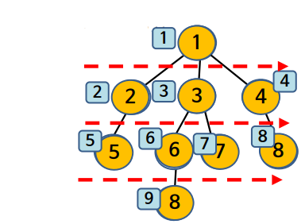

너비 우선 탐색(BFS, Breadth-First Search)
================================

### 그래프에서 완전 탐색 방법 중 하나이다. 탐색하려는 트리의 루트노트부터 목표노드를 만날 때 까지 단계별로 횡(수평)방향으로 탐색을 진행해 나가는 방식이다.

1. 장점

- 출발노드에서 목표노트까지의 최단 길이 경로를 보장한다.

2. 단점

- 경로가 매우 길 경우에는 탐색 가지가 급격히 증가함에 따라 보다 많은 기억 공간을 필요로한다.

- 해가 존재하지 않는다면 유한 그래프의 경우에는 모든 그래프를 탐색한 후에 실패로 끝난다.

- 무한 그래프의 경우에는 결고 해를 찾지도 못하고, 끝내지도 못한다.